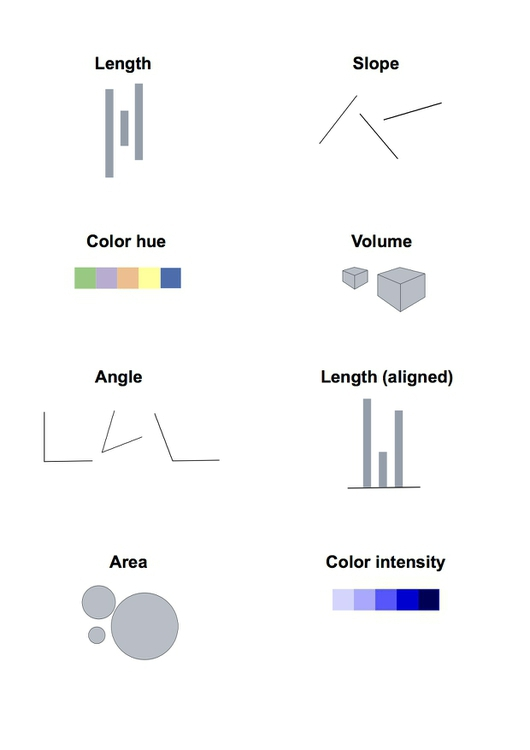
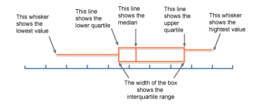

<style>
body {
  text-align: justify
}

.caption {
  text-align: center
}

caption {
  text-align: center
}


</style>

\newpage
# Introduction

El objetivo de este manual es proveer la base necesaria para analizar y visualizar datos de Open Contracting usando el lenguaje de programación R a las personas interesadas en esta interesante y desafiante tarea. Un conocimiento básico de programación de computadoras será útil a leer este documento;  sin embargo, se proveerá una guía suficiente para que lectores menos técnicos puedan también seguir el manual.

Como parte de esta guía, se obtendrán, limpiarán, analizarán y graficarán datos de Open Contracting de 4 países miembros de la Open Contracting Partnership: Paraguay, México, Uruguay y Colombia. Este documento fue escrito utilizando [R Notebooks](https://rmarkdown.rstudio.com/r_notebooks), una herramienta que permite integrar Markdown y código R de manera conveniente, pudiendo exportarse el resultado en formato HTML y PDF. El código fuente de este proyecto está disponible [aquí](https://https://github.com/rparrapy/ocds-r-manual).

El resto de este documento está organizado de la siguiente manera:

* El resto de esta sección introduce el estándar de datos Open Contracting, describiendo brevemente sus principales elementos, y el lenguaje de programación R, cubriendo sus funcionalidades más importantes y como instalarlo.

*  La sección 2 trata de la adquisición y limpieza de datos, haciendo énfasis en la lectura y procesamiento de archivos en formato JSON con R.

* La sección 3 presenta el [Tidiverse](https://www.tidyverse.org), una colección de paquetes de R diseñados para realizar tareas de ciencia de datos.
  
  
* Finalmente, la sección 4 introduce [ggplot2](https://ggplot2.tidyverse.org) y la gramática de gráficos en la cual está basado, para luego dibujar varias visualizaciones que describen los datasets adquiridos.
  
  
## Una introducción al estándar de datos Open Contracting

Al requerir que los datos se compartan de forma estructurada, reusable y legible por las máquinas, los datos abiertos abren nuevas oportunidades para la participación y el empoderamiento ciudadanos. El [estándar de datos Open Contracting](https://www.open-contracting.org/data-standard/) fue creado para aplicar estos principios al ciclo de vida de contrataciones públicas incluyendo la planificación, licitación, adjudicación, contratación y ejecución.

Este estándar de datos, diseñado y desarrollado a través de un proceso abierto, permite a los gobiernos alrededor del mundo compartir sus datos de contrataciones, mejorando así los niveles de transparencia en las compras públicas, y haciendo posible el análisis de los sistemas de contrataciones públicas en términos de eficiencia, efectividad, justicia e integridad. Además, el equipo de help desk está disponible para asistir a potenciales usuarios en el proceso de adopción del estándar.

La intención de esta sección es introducir el estándar al lector, los casos de uso para los cuales fue diseñado y los conceptos básicos necesarios para su aplicación. La mayoría del contenido fue obtenido de la documentación oficial del estándar; para una introducción más detallada del estándar, favor referirse a la [guía para empezar](http://standard.open-contracting.org/latest/en/getting_started/).

The intention of this section is to introduce the reader to the standard, the use cases it was designed for and the basic concepts needed to apply it. Most of the content was taken from the official documentation of the standard; for a more thorough introductory walktrough, please refer to the [getting started guide](http://standard.open-contracting.org/latest/en/getting_started/).

### Usuarios y casos de uso

El estándar fue diseñado con cuatro grupos de necesidades de usuario en mente:

* Lograr un buen valor por dinero para el gobierno
* Fortalecimiento de la transparencia, rendición de cuentas e integridad de los contratos públicos
* Permitir al sector privado una competencia justa por contratos públicos
* Control de la eficacia de la prestación de servicios

Para saber quien está usando datos publicados de acuerdo al estándar y de que manera lo están haciendo, dirigirse al [sitio web de la Open Contracting Partnership](http://www.open-contracting.org/). Cuatro casos de uso potenciales de datos abiertos de contrataciones son:


* Valor por dinero en la adquisición: ayudando a oficiales de gobierno a lograr un bune valor por dinero durante el proceso de contratación, y analizando si esta meta fue lograda con posterioridad.
* Detección de fraude y corrupción: identificando banderas rojas que puedan indicar corrupción mediante el estudio de contratos individuales o redes de contratación basadas en financiación, propiedad e intereses.
* Competencia por contratos públicos: permitiendo a empresas privadas comprender el potencial de los canales de oportunidades de compras públicas, mediante el estudio de información relacionada a contrataciones pasadas y presentes.
* Supervisión de la prestaciónd e servicios: ayudando a actores interesados a aprovechar la trazabilidad del proceso de contrataciones públicas con fines de monitoreo, relacionando datos de presupuesto a los contratos y resultados de su ejecución.

### El proceso de contratación

El estándar define el proceso de contratación como:

> Toda la información relativa a la planeación, la licitación, las adjudicaciones, los contratos y la ejecución de contratos relacionados con un solo proceso de iniciación.

El estándar cubre todas las etapas del proceso de contratación, aunque algunos procesos pueden no incluir todos los pasos posibles. Las etapas del proceso de contratación, con ejemplos de atributos que pueden estar asociados a cada una, se presentan en la siguiente figura.


```{r include=FALSE}
knitr::opts_chunk$set(cache = TRUE, warning = FALSE, 
                      message = FALSE, cache.lazy = FALSE)
```


```{r, echo=FALSE, fig.cap="Etapas del proceso de contratación."}
knitr::include_graphics("procurement-stages.png")
```

Con fines de identificación, cada proceso de contratación tiene asignado un identificador único de Open Contracting (ocid), el cual puede utilizarse para relacionar datos de diferentes etapas. De modo a evitar solapamiento entre publicadores, un publicador puede incluir un prefijo a todos los identificadores que genera. Se recomienda a los publicadores registrar su prefijo [aquí](http://standard.open-contracting.org/latest/en/implementation/registration/).


### Documentos

Los procesos de contratación son representados como **documentos** en el estándar de datos Open Contracting (OCDS de aquí en adelante, por brevedad). Cada documento está compuesto por varias **secciones**, mencionadas a continuación:


* metadatos de la entrega (release metadata): información contextual sobre cada entrega de datos;
    * partes (parties): información sobre las organizaciones y otros participantes involucrados en el proceso de contratación;
    * planeación (planning): información sobre los objetivos, presupuestos y proyectos a los que se refiere un proceso de contratación;
    * licitación (tender): información sobre la forma en que tendrá lugar la licitación o se ha realizado;
    * adjudicación (award): información sobre las adjudicaciones otorgadas como parte de un proceso de contratación;
    * contracto (contract): información sobre contratos firmados como parte de un proceso de contratación;
        * implementación (implementation): información sobre el progreso de cada contrato hasta su finalización.

Un documento JSON de ejemplo con este estructura luce de la siguiente manera: 

```json
{
   "language": "en",
   "ocid": "contracting-process-identifier",
   "id": "release-id",
   "date": "ISO-date",
   "tag": ["tag-from-codelist"],
   "initiationType": "tender",
   "parties": {},
   "buyer": {},
   "planning": {},
   "tender": {},
   "awards": [ {} ],
   "contracts":[ {
       "implementation":{}
   }]
}
```

Existen dos tipos de documentos definidos en el estándar: 

* **Entregas** son inmutables y representan actualizaciones al proceso de contratación. Por ejemplo, pueden utilizarse para notificar a usuarios acerca de nuevas licitaciones, adjudicaciones, contratos y otras actualizaciones. De este modo, un único proceso de contratación puede tener muchas entregas.


* **Registros** son instantáneas del estado actual del proceso de contratación. Un registro debe ser actualizado cada vez que se publica una entrega asociada al proceso de contratación; de este modo, debe existir un único registro por cada proceso de contratación.


### Campos

Cada sección puede contener varios **campos** especificados en el estándar, los cuales se utilizan para representar datos. Estos elementos pueden aparecer varias veces en diferentes secciones del mismo documento; por ejemplo, pueden haber items en la licitación (para indicar items que un comprador desea comprar), en la adjudicación (para indicar items que han sido adjudicados) y en el contrato (para indicar items que forman parte del contrato). Algunos campos, acompañados de documentos JSON correspondientes, se presentan a continuación.

Each section may contain several **fields** specified in the standard, which are used to represent data. These objects can appear several times in different sections of the same document; for example, items can occur in tender (to indicate the items that a buyer wishes to buy), in an award object (to indicate the items that an award has been made for) and in a contract object (to indicate the items listed in the contract). Some example fields, accompanied by corresponding JSON snippets, are presented below.

#### Partes (Organizaciones)

```json
{
    "address": {
        "countryName": "United Kingdom",
        "locality": "London",
        "postalCode": "N11 1NP",
        "region": "London",
        "streetAddress": "4, North London Business Park, Oakleigh Rd S"
    },
    "contactPoint": {
        "email": "procurement-team@example.com",
        "faxNumber": "01234 345 345",
        "name": "Procurement Team",
        "telephone": "01234 345 346",
        "url": "http://example.com/contact/"
    },
    "id": "GB-LAC-E09000003",
    "identifier": {
        "id": "E09000003",
        "legalName": "London Borough of Barnet",
        "scheme": "GB-LAC",
        "uri": "http://www.barnet.gov.uk/"
    },
    "name": "London Borough of Barnet",
    "roles": [ ... ]
}
```

#### Montos

```json
{
    "amount": 11000000,
    "currency": "GBP"
}
```

#### Artículos

```json
{
    "additionalClassifications": [
       {
            "description": "Cycle path construction work",
            "id": "45233162-2",
            "scheme": "CPV",
            "uri": "http://cpv.data.ac.uk/code-45233162.html"
        }
    ],
    "classification": {
        "description": "Construction work for highways",
        "id": "45233130",
        "scheme": "CPV",
        "uri": "http://cpv.data.ac.uk/code-45233130"
    },
    "description": "string",
    "id": "0001",
    "quantity": 8,
    "unit": {
        "name": "Miles",
        "value": {
            "amount": 137000,
            "currency": "GBP"
        }
    }
}
```

#### Periodos de tiempo

```json
{
    "endDate": "2011-08-01T23:59:00Z",
    "startDate": "2010-07-01T00:00:00Z"
}
```

#### Documentos

```json
{
    "datePublished": "2010-05-10T10:30:00Z",
    "description": "Award of contract to build new cycle lanes to AnyCorp Ltd.",
    "documentType": "notice",
    "format": "text/html",
    "id": "0007",
    "language": "en",
    "title": "Award notice",
    "url": "http://example.com/tender-notices/ocds-213czf-000-00001-04.html"
}
```

#### Hitos

```json
{
    "description": "A consultation period is open for citizen input.",
    "dueDate": "2015-04-15T17:00:00Z",
    "id": "0001",
    "title": "Consultation Period"
}
```


### Extensiones y listas de códigos

Además de los campos comunes, el esquema OCDS define algunos campos que pueden usarse solamente en secciones específicas, por ejemplo *titulos* y *descripciones* de licitaciones, adjudicaciones y contratos. En algunos casos, los publicadores pueden requerir campos que no se proporcionan en el esquema central de OCDS; una **extensión** permite definir nuevos campos que pueden usarse en estos casos. Una lista de extensiones disponibles se encuentra publicada [aquí](http://standard.open-contracting.org/latest/en/extensions); en caso de que no exista una extensión que se ajuste a las necesidades del publicador, se anima al mismo a colaborar en la creación de una nueva extensión comunitaria.

Otro concepto que vale la pena mencionar son las listas de códigos. Las listas de códigos son colecciones de cadenas con distinción entre mayúsculas y minúsculas con etiquetas asociadas, disponibles en cada idioma al que se ha traducido OCDS. Los publicadores deben utilizar valores de las listas de códigos cuando sea posible para mapear sus sistemas de clasificación actual; en caso de ser necesario, los campos de detalle pueden utilizarse para proveer información de clasificación más detallada. Existen dos tipos de listas de códigos:


* **Listas de códigos cerradas** son conjuntos fijos de valores. Si un campo se asocia a una lista de códigos cerrada, debe aceptar como valor únicamente una de las opciones de esta lista.
* **Listas de códigos abiertas** son conjuntos de valores recomendados. Si un campo se asocia a una lista de códigos abierta, debe aceptar valores de la lista pero puede aceptar también otros valores.


El estándar de datos Open Contracting se mantiene usando [JSON Schema](http://json-schema.org). En esta sección introdujimos y describimos sus secciones principales y elementos comunes del esquema, proveyendo documentos JSON como ejemplos de estos bloques básicos. Para acceder a una referencia del esquema JSON completo, el lector puede dirigirse a la [documentación oficial](http://standard.open-contracting.org/latest/en/schema/).


## Una introducción al lenguaje de programación R

R es un lenguaje de programación interpretado multiparadigma y un ambiente de desarrollo software orientado a la computación estadística, utilizado comúnmente para análisis de datos. Se publica bajo [la licencia GPL v2](https://www.gnu.org/licenses/old-licenses/gpl-2.0.html) y su mantenimiento está a cargo de la [R Foundation](https://www.r-project.org/foundation/), con paquetes binarios disponibles para GNU/Linux, macOS and Windows. Aunque el instalador básico incluye una interfaz por línea de comandos, varios ambientes de desarrollo integrados gráficos (IDE) se encuentran disponibles, entre los cuales RStudio y RStudio Server merecen mención especial[^1].

En esta sección introduciremos la sintaxis y algunas funcionalidades básicas de R; luego de esto, el lector estará mejor preparado para entender el código utilizado para el análisis del resto de esta guía. Una referencia completa del lenguaje R se encuentra fuera del alcance de este documento, razón por la cual varias funcionalidades se omiten en esta sección. Si el lector se sintiese inclinado a aprender más sobre R, por necesidad o curiosidad, una lista de manuales mantenidos por el equipo de desarrollo de R se encuentra disponible [aquí](https://cran.r-project.org/manuals.html). 

Con propósitos de completitud y reproducibilidad, incluimos a continuación un fragmento de información de sistema.

```{r}
R.version
```
  

[^1]: El autor recomiendo RStudio como la manera más conveniente de ejecutar código R y cree que este IDE es una de las principales razones tras la popularidad de R. En consecuencia, esta guía fue escrita usando RStudio v1.1.453 en macOS High Sierra.


### Operadores

Los operadores aritméticos y lógicos de R no deberían ser nada nuevo para la mayoría de los programadores, ya que son parecidos a los de otros lenguajes de programación. Merece mención el hecho de que los operadores aritméticos funcionan con escalares y colecciones.

| Operador | Descripción |
|:--------:|:-----------|
| **+**    | Adición    |
| **-**    | Substracción |
| **\* **  | Multiplicación|
| **/**    | División    |
| **\*\* ** or **^**|Exponenciación&nbsp;&nbsp;&nbsp;&nbsp;&nbsp;&nbsp;&nbsp;&nbsp;&nbsp;&nbsp;&nbsp;&nbsp;&nbsp;&nbsp;&nbsp;&nbsp;|
| **%%**   | Módulo     |
Table: Algunos operadores aritméticos de R


| Operador | Descripción |
|:--------:|:-----------|
| **>**    | Mayor que    |
| **>=**   | Mayor o igual que|
| **<**    | Menor que|
| **<=**   | Menor o igual que|
| **==**   | Igual a |
| **!=**   | Diferente a |
Table: Algunos operadores lógicos de R

### Variables

R soporta varios tipos de datos incluyendo escalares, vectores (de números, cadenas, booleanos, etc), matrices, dataframes y tibbles, entre otros. El operador **<-** se usa para asignar un valor a una variable. Algunos ejemplos de variables de estos tipos se muestran a continuación:


```{r}
a_scalar <- 4

a_number_vector <- c(1, 2, 3, 4, 5) # todos los elementos de un vector deben ser del mismo tipo
a_string_vector <- c("a1", "b2", "c3", "d4")
a_boolean_vector <- c(TRUE, FALSE)

# las listas pueden tener elementos de distintos tipos, asociados a una clave
a_list <- list(name = "John", last_name = "Deer", age = 42, married = FALSE)

# hay varias formas de acceder a un elemento de una colección
a_number_vector[0]
a_string_vector[[1]]
a_list$name

# una matriz es un tipo especial de vector, con número de filas y columnas como atributos
m <- matrix(c(1, 2, 3, 4), nrow = 2, ncol = 2)
m
```

### Data Frames y Tibbles

Los tipos de datos para almacenar tablas son centrales al propósito y funcionalidad de R, por este motivo merecen su propia subsección. El tipo más común de tabla en R son los data frames, los cuales pueden considerarse como una lista de vectores de igual longitud.


```{r}
name <- c("Mike", "Lucy", "John")
age <- c(20, 25, 30)
student <- c(TRUE, FALSE, TRUE)
df <- data.frame(name, age, student)
df
```

Los operadores de acceso presentados para otros tipos de datos también pueden usarse para obtener celdas de un data frame.

```{r}
df[1, ] # En R, las colecciones empiezan con el índice 1.
df[1, ]$name # Los valores de una fila puede accederse usando el nombre de la columna.
df$name # También es posible acceder a una columna directamente a partir del data frame.
```

Otro tipo de tabla de datos disponible son los Tibbles. Los Tibbles pertenecen al Tidyverse, un conjunto de librerías para realizar análisis de datos en R siguiendo buenas prácticas que se describirá con más detalle en otra sección. Por ahora, basta pensar en los Tibbles como data frames con algunos problemas solucionados. Por ejemplo, al imprimir un data frame se despliegan todas las filas en pantalla, lo cual puede resultar problemático para datasets grandes; en cambio, al imprimir un Tibble se despliegan solamente las primeras 10 filas por defecto.

Un data frame puede convertirse a Tibble y viceversa; este último caso puede ser útil al lidiar con librerías antiguas que no estén adaptadas al Tidyverse. El autor aconseja el uso de tibbles y recomienda (como muchos miembros de la comunidad) aprovechar las funcionalidades del Tidiverse y respetar sus delineamientos tanto como sea posible.

```{r message=FALSE, warning=FALSE}
# Packrat debe haber instalado las dependencias del proyecto,
# caso contrario, puedes hacerlo manualmente con el siguiente comando
# install.packages("tidiverse")
library(tidyverse) # Nota: así se importa un paquete en R
```

```{r}
tb <- as_tibble(df)
class(as.data.frame(tb))
```

### Funciones

La sintaxis para definición de funciones en R es bastante similar a la de otros lenguajes de programación. Una función recibe cero, uno o múltiples argumentos y ejecuta el código incluido en su cuerpo:


> function ( arglist ) {body}

Debido a que R apunta a un nicho específico (computación estadística), el lenguaje ofrece un conjunto rico de funciones por defecto, además de muchas librerías disponibles para su instalación. Por este motivo, las llamadas a funciones tienden a ser mucho más frecuentes en R que la definición de funciones.

La mayor parte del ecosistema de R está enfocado en tratar (limpiar, visualizar, modelar) datos tabulares. Como ejemplo sencillo de las funcionalidades estadísticas básicas podemos usar la función *summary* para obtener estadísticas descriptivas de una tabla.

```{r}
summary(tb)
```


Leer datos que se encuentran en formato tabular también es muy simple, como se muestra en el siguiente ejemplo que lee un archivo CSV como un data frame. El archivo corresponde al dataset iris, un dataset de ejemplo común en la literatura de ciencia de datos disponible [en línea](https://archive.ics.uci.edu/ml/datasets/iris).

```{r}
iris <- as_tibble(read.table("iris.csv", header = TRUE, sep = ","))
iris
```

Un último operador que vale la pena mencionar es el pipe *%>%*. Este operador permite encadenar funciones en R, lo cual favorece la legibilidad y (podría decirse) elegancia cuando se requiere una secuencia de llamadas a función.

```{r}

# Por ahora, no es necesario entender que hace cada función en este fragmento de código
iris %>%
  group_by(Name) %>%
  summarize_if(is.numeric, mean) %>%
  ungroup()
```

El operador pipe pasa el valor de su operando izquierdo como el primer argumento de su operando derecho. De esta forma, al usarlo podemos evitar la declaración de variables para almacenar resultados intermedios (que ensucian el espacio de nombres) o el anidamiento de llamadas (que pueden ser difíciles de leer con tantos paréntesis).


### Estilo

Como observación final, aunque no existe una guía de estilo oficial para el lenguaje de programación R, el autor recomienda seguir la [guía de estilo del Tidyverse](http://style.tidyverse.org/index.html)[^2](lo cual no debería ser una sorpresa para el lector atento). El paquete [styler](http://styler.r-lib.org) es un linter y formateador de código conveniente para mantener el código fuente de acuerdo a los delineamientos de la guía; existe un add-in para RStudio disponible.


[^2]: Este notebook fue escrito intentando respetar la guía de estilo del Tidyverse. Cualquier fragmento de código que no lo siga puede atribuirse a la falta de buen café en ese punto del proceso de redacción :)

 
## Instalando R y otras dependencias

Asumiendo una máquina corriendo Ubuntu 18.04 Bionic Beaver como sistema operativo, un usuario con acceso *sudo* puede instalar el lenguaje de programación R y RStudio siguiendo estos pasos:

1. Actualiza los paquetes del sistema para asegurar que las dependencias ya instaladas estén actualizadas. 
```{bash, eval=FALSE}
sudo apt update
```
2. Instala el lenguaje de programación R.
```{bash, eval=FALSE}
sudo apt -y install r-base
```
3. RStudio para Ubuntu viene empaquetado como un paquete *.deb*. La forma más fácil de instalarlo es usando el comando *gdebi*, el cual no es encuentra instalado en el sistema por defecto, pero puede instalarse con el siguiente comando. 
```{bash, eval=FALSE}
sudo apt install gdebi-core
```
4. Ve a la [página de descargas del sitio oficial de RStudio](https://www.rstudio.com/products/rstudio/download/#download) y descarga el archivo correspondiente a tu sistema operativo. En nuestro escenario actual, el archivo sería *RStudio 1.1.456 - Ubuntu 16.04+/Debian 9+ (64-bit)*.
5. Desde el directorio en el cual descargaste el paquete en el último paso, instala RStudio usando *gdebi*.
```{bash, eval=FALSE}
sudo gdebi rstudio-xenial-1.1.456-amd64.deb
```
6. RStudio debería estar disponible para su ejecución mediante el comando *rstudio* o clickeando su ícono en el menú de aplicaciones.

Además de RStudio Desktop, el cual puede instalarse siguiendo los pasos anteriores, RStudio también se encuentra disponible en una versión de acceso remoto. RStudio Server es una aplicación que puede instalarse en un servidor web, ofreciendo de esta manero las mismas funcionalidades que la versión de escritorio a través de un navegador web. Para saber más acerca de esta alternativa y como instalarla, favor referirse a la [documentación oficial](https://www.rstudio.com/products/rstudio/download-server/).

El proyecto a partir del cual se generó este documento usa [Packrat](https://rstudio.github.io/packrat/) para la gestión de librerías de las cuales depende. Esto asegura la portabilidad del software (al importar el proyecto, se instalará la versión apropiada para el sistema operativo de cada paquete) y la reproducibilidad del análisis. De este modo, asumiendo que Git está instalado en el sistema, puedes bajar y jugar con este notebook de forma fácil:


1. Clona el proyecto
```{bash, eval=FALSE}
git clone https://github.com/rparrapy/ocds-r-manual.git
```
2. Abre el proyecto con  RStudio usando la opción del menú **File -> Open Project...**


También usaremos una base de datos Postgres para nuestro análisis, por lo cual debemos instalar Postgres en caso de que no se encuentre en nuestro sistema. Podemos hacer esto ejecutando:

```{bash, eval=FALSE}
sudo apt install postgresql postgresql-contrib
```

El último comando instala el motor de bases de datos Postgres y crea un usuario *postgres* a ser utilizado como cuenta por defecto para el acceso a bases de datos.

# Adquisición de datos

Esta sección se enfoca en la lectura de datos a partir de diversas fuentes, el cual representa el primer paso para el proceso de análisis. Se cargarán datos de los cuatro países que conciernen a este documento, usándolos como ejemplos de distintos métodos de adquisición de datos:


* Los datos de Uruguay se leerán usando su API web pública. 
* Los datos de Paraguay se leerán de archivos JSON previamente descargados. 
* Los datos de México y Colombia se leerán de columnas JSONB de una base de datos Postgres. Como en este caso se tratará con volúmenes más grandes de datos, se usará como ejemplo de como procesar big data con R
usando JSON streams y procesamiento paralelo.


## De una API REST

El dataset de open contracting de Uruguay se encuentra disponible a través de un endpoint RSS, el cual incluye las URL de las últimas entregas. Cabe mencionar que, como se disponibilizan solo las entregas más recientes, no es posible realizar mucho análisis a profundidad basado en este dataset. Aún así, es un ejemplo apropiado para mostrar las funcionalidades de cliente HTTP de R; empezamos obteniendo el feed RSS y creando un dataframe donde cada fila corresponde a una entrega.


```{r}
library(XML)

xml_url <- "http://www.comprasestatales.gub.uy/ocds/rss"
xml_file <- xmlParse(xml_url)
xml_top <- xmlRoot(xml_file)[[1]]

index_tb <- as_tibble(xmlToDataFrame(xmlElementsByTagName(xml_top, "item")))
index_tb
```

En el fragmento anterior, empezamos importando la librería *XML* de R debido a que las respuestas de la API de Uruguay se encuentran en este formato. El método *xmlParse* obtiene el contenido del feed RSS y lo parsea, retornando un array anidado que representa un árbol. Procedemos entonces a obtener la raíz de este árbol y buscar cada elemento con la etiqueta *item* usando el método *xmlElementsByTagName*. Convertimos el resultado a un dataframe y posteriormente a un tibble usando *xmlToDataFrame* y *as_tibble respectivamente.

Procedemos luego a obtener el documento JSON correspondiente a cada entrega, usando los valores de la columna **link** del tibble definido con anterioridad. Existen muchas librerías para manejar documentos JSON con R, cada una con sus ventajas y desventajas; debido a su énfasis en el rendimiento y consumición de APIs web, en esta guía usamos [jsonlite](https://cran.r-project.org/web/packages/jsonlite/index.html).


```{r message=FALSE, warning=FALSE}
library(jsonlite)
```

```{r, cache=TRUE}
# corremos fromJSON (que obtiene el contenido de la URL) por cada fila del data frame
releases <- apply(index_tb["link"], 1, function(r) {
  return(as_tibble(fromJSON(r, flatten = TRUE)[["releases"]]))
})
releases[[1]]
```


La principal función del fragmento de código anterior es *fromJSON*, la cual es proveida por *jsonlite*. 
La utilizamos para obtener los documentos JSON a partir de la url contenida en la columna *link* de *index_tb*. La bandera flatten indica que queremos que la función aplane lo más posible la estructura de los JSON anidados, dejándolos en un formato más apropiado para su representación tabular. Repetimos este proceso por cada file del tibble usando la función *apply*, la cual ejecuta la función que recibe como parámetro por cada file y retorna una lista como resultado.

En este punto tenemos una lista de tibbles, cada uno representando una entrega. El siguiente paso es unir estos tibbles, rellenando los valores faltantes (por ejemplo, de acuerdo a la etapa a la que corresponden, algunas entregas contienen información de licitación mientras otras no) con NA (la constanste de R que simboliza 'no disponible'). Podemos lograr esto usando la función *bind_rows*.


```{r, cache=TRUE}
releases_tb <- bind_rows(releases)
```

Debido a que los datos de Uruguay incluyen solo las últimas 500 entregas, la compilación de estas entregas para formar registros no es posible (no hay suficientes datos). Por este motivo, este fue el último uso de los datos uruguayos en esta guía.


## A partir de archivos JSON

También podemos leer registros o entregas a partir de un conjunto de archivos JSON, publicados por uno o más publicadores oficiales asociados a un país. Este es el caso de Paraguay, el siguiente país que añadiremos a nuestro análisis. Los datos abiertos de contrataciones de este país son publicados por la Dirección Nacional de Contrataciones Públicas (DNCP) y por el Ministerio de Hacienda; como comparten ocids, es posible usar los datos publicados por ambos de forma conjunta.

Para continuar con esta guía es necesario obtener una copia de los datasets y almacenarla en el disco duro local, bajo el directorio *./data* (el cual se encuentra vacío luego de clonar el proyecto). Esto es:

1. Dirígete a [https://mega.nz/#F!PCQFzAyY!m54DS0hA3pyKXqergJUBFQ](https://mega.nz/#F!PCQFzAyY!m54DS0hA3pyKXqergJUBFQ).
2. Descarga el archvio *data.zip* y extrae su contenido en *./data*.
3. En caso de éxito, dos nuevas carpetas con archivos .json deben estar disponibles en el sistema: *./data/records_dncp* y *./data/releases_mh*.


Antes de leer los datos, tomémonos un tiempo para hacer que nuestro procesamiento de datos sea más eficiente. El tamaño de los datasets que analizamos en esta guía va desde no trivial (el procesamiento toma unos pocos minutos) hasta desafiante (el procesamiento toma varias horas). Esto se agrava si consideramos que R se ejecuta en un único hilo por defecto, desaprovechando los múltiples cores que ofrecen la mayoría de las computadoras modernas. Para cambiar esto, podemos usar la librería *parallel*, la cual permite ejecutar funciones como apply y similares de forma paralela.


```{r, warning=FALSE, message=FALSE}
library(glue) # Utilitario para concatenar cadenas
library(parallel)
library(lubridate) # si tienes que trabajar con fechas, hazte el favor de usar esta librería


# Calculamos el número de cores
no_cores <- detectCores() - 1
# Iniciamos el cluster
cl <- makeCluster(no_cores)
clusterExport(cl, c("fromJSON", "paste", "as_tibble", "ymd_hms", "select"))
```


Para empezar a usar parallel, definimos un cluster de tamaño igual al número de cores disponibles en nuestra máquina menos uno (si no dejamos ningún core libre para otro cómputo la computadora puede dejar de responder) con la función *makeCluster*. Cada uno de los trabajadores de nuestro cluster ejecuta un intérprete de R sin ninguna otra dependencia; para importar las librerías que utilizaremos usamos la función *clusterExport*.

Ahora estamos listos para empezar con los datos de la DNCP, los cuales están almacenados en *data/records_dncp*:


```{r, cache=TRUE}
files <- list.files("data/records_dncp/", "*.json")
records <- parLapply(cl, files, function(r) {
  file <- paste("data/records_dncp/", r, sep = "")
  parsed <- fromJSON(file, flatten = TRUE)
  records <- parsed[["records"]]
  publishedDate <- ymd_hms(parsed[['publishedDate']])
  records$publishedDate <- rep(publishedDate, nrow(records))
  return(as_tibble(records))
})
records[[1]]
```

El anterior fragmento de código usa varias de las funciones que ya utilizamos como *fromJSON*, *as_tibble* y otras. Hay tres nuevas funciones que mereces una explicación:

* *list.files* retorna una lista de direcciones correspondientes a archivos almacenados en la dirección que recibe como primer parámetro, que matchean la expresión regular que recibe como segundo parámetro.
* *paste* concatena todas las cadenas que recibe, colocando *sep* entre ellas. 
* *parLapply* es la versión paralela de *lapply*, la cual ejecuta la función que recibe como parámetro en los diferentes trabajadores del cluster. Esto puede hacerse debido a que la lectura y parseo de archivos JSON es una tarea vergonzosamente paralela. 

```{r, cache=TRUE}
dncp_records_tb <- bind_rows(records)
remove(records)
dncp_records_tb
```

Para liberar un poco de espacio, usamos la función *remove* que elimina explícitamente una variable de memoria. Los datos del Ministerio de Hacienda pueden leerse de forma similar:

```{r, cache=TRUE}
files <- list.files("data/releases_mh/", "*.json")
releases <- parLapply(cl, files, function(r) {
  file <- paste("data/releases_mh/", r, sep = "")
  parsed <- fromJSON(file, flatten = TRUE)
  releases <- parsed[["releases"]]
  publishedDate <- ymd_hms(parsed[['publishedDate']])
  # there are some files that don't include any release (?)
  if (!is.null(nrow(releases)) && nrow(releases) > 0) {
      releases$publishedDate <- rep(publishedDate, nrow(releases))
  }
  return(as_tibble(releases))
})

mh_releases_tb <- bind_rows(releases)
remove(releases)
mh_releases_tb
```

## Desde una base de datos Postgres con columnas JSONB

Para México y Colombia procesaremos los datos en modo streaming; esto es, un registro a la vez. Los dataframes y tibbles se almacenan por completo en memoria, en cambio el procesamiento de un stream requiere mantener solo un registro en memoria. Por esta razón, este paradigma de procesamiento de datos resulta útil al lidiar con big data.

Para continuar con esta guía, debes descargar los archivos de backup de estas bases de datos a tu computadora y restaurarlos en tu instancia local de Postgres. Para hacerlo:

1. Dirígete nuevamente a [https://mega.nz/#F!PCQFzAyY!m54DS0hA3pyKXqergJUBFQ](https://mega.nz/#F!PCQFzAyY!m54DS0hA3pyKXqergJUBFQ).
2. Descarga los archivos *ocds_colombia.dump* y *ocds_mexico.dump* a tu disco duro local.
3. Crea las bases de datos ejecutando *sudo -u postgres createdb ocds_colombia* y *sudo -u postgres createdb ocds_mexico* desde una terminal.  
3. En otra sesión de terminal, desde el directorio donde descargaste los backups, ejecuta *pg_restore -d ocds_colombia ocds_colombia_dump* y *pg_restore -d ocds_mexico ocds_mexico.dump*.
4. Verifica las bases de datos que acabas de crear. Deben contener múltiples tablas que se crearon durante el proceso de restauración. En particular, la tabla *data* debe contener los registros para nuestro análisis. 

La librería que utilizamos (jsonlite) incluye la función *stream_in* para soportar [ndjson](http://ndjson.org), un formato conveniente para almacenar múltiples documentos JSON en un único archivo. Como nuestros registros están almacenados en una base de datos Postgres, debemos escribir una funcionalidad similar nosotros mismos. Hagamos exactamente esto en los próximos fragmentos de código:


```{r}
library(RPostgreSQL)

db_engine <- "PostgreSQL"
host <- "localhost"
user <- "postgres" # si te preocupa la seguridad
password <- "" # deberías cambiar estas 2 líneas
port <- 5433
query <- "SELECT id, data FROM data"

drv <- dbDriver(db_engine)
con_colombia <- dbConnect(drv, host = host, port = port,
                          dbname = "ocds_colombia", user = user, password = password)

con_mexico <- dbConnect(drv, host = host, port = port,
                        dbname = "ocds_mexico", user = user, password = password)
```

Nos conectaremos y realizaremos consultas a Postgres a través de [DBI](https://cran.r-project.org/web/packages/DBI/index.html), una definición de interfaz para comunicaciones entre R y motores de bases de datos relacionales. En particular, usaremos  [RPostgreSQL](https://cran.r-project.org/web/packages/RPostgreSQL/index.html), una implementación de DBI para bases de datos Postgres.

```{r}
stream_in_db <- function(con, query, page_size = 1000, acc = 0) {
  current_id <- 0

  return(function(handler) {
    repeat{
      paged_query <- paste(query, "WHERE id > ", current_id, "ORDER BY id ASC LIMIT", page_size)
      data <- dbGetQuery(con, paged_query)

      if (dim(data)[1] == 0) {
        break
      }
      
      acc <- handler(data[['data']], acc)
      current_id <- tail(data[['id']], n=1)
    }
    return(acc)
  })
}

stream_in_colombia <- stream_in_db(con_colombia, query)

stream_in_mexico <- stream_in_db(con_mexico, query)
```

Repasemos lo que acabamos de hacer:

1. Primero, definimos una función *stream_in_db* que recibe los parámetros de conexión a la base de datos y una consulta, y ejecuta esta consulta contra la base de datos especificada.
1. *stream_in_db* retorna una función, la cual aplica un handler que recibe como parámetro a cada página de resultados.
1. Finalmente, usamos *stream_in_db* para obtener funcionaes apuntando a las bases de datos de México y Colombia.

El desempeño de la paginación de resultados usando *LIMIT* and *OFFSET* se degrada conforme visitamos páginas más alejadas del inicio. Para acelarar el procesamiento lo más posible usamos una técnica de paginación conocida como *keyset pagination*, la cual aprovecha el hecho de que existe un índice definido para la clave primaria. Para una comparación más detallada de métodos de paginación se recomienda leer [este artículo](http://allyouneedisbackend.com/blog/2017/09/24/the-sql-i-love-part-1-scanning-large-table/).

Para probar nuestras funciones de streaming, podemos definir un handler de prueba que solo cuente el número de filas que resultan de nuestra consulta:

```{r message=FALSE, warning=FALSE, echo=FALSE, eval=FALSE}
sanity_checker <- function(data, acc) {
  m <- parLapply(cl, data, function(e) {
    t <- fromJSON(e, flatten = TRUE)
    return(1)
  })
  
  return(acc + Reduce("+", m))
}
```


# Análisis de datos de contrataciones

Esta sección introduce un conjunto de herramientas útiles para realizar análisis de datos usando R, acompañados de algunos ejemplos básicos para demostrar sus funcionalidades.

## Introducción al Tidyverse
El Tidyverse es una colección de paquetes R orientados a las tareas de ciencia de datos; además de las librerías, comparte un conjunto de estructura de datos, una guía de estilo y una filosofía subyacente para el análisis de datos. Los principales [paquetes](https://www.tidyverse.org/packages/) del Tidyverse son:

* gglplot2: un sistema para crear gráficos de forma declarativa, basado en la "Gramática de los Gráficos", una herramienta que permite al usuario describir la mayoría de los mapeos utilizados en la visualización de datos de forma concisa. Uno provee los datos, le indica a ggplot2 como mapear las variables a *aesthetics*, que primitivas visuales utilizar, y la herramienta se encarga de los detalles.
* dplyr: una implementación de una gramática para la manipulación de datos, la cual provee un conjunto consistente de verbos para solucionar la mayoría de los desafíos de la manipulación de datos. 
* tidyr: provee un conjunto de funciones que ayudan en la obtención de datos ordenados (tidy). Los datos ordenados son datos en una forma consistente: cada variable corresponde a exactamente una columna, y cada columna es exactamente una variable. 
* readr: provee una forma rápida y amigable de leer datos tabulares (como csv, tsv y fwf).
* purrr: mejora las funcionalidades de R para la programación funcional proveyendo un conjunto de herramientas completo y consistente para trabajar con funciones y vectores.
* tibble: una reimplementación de la estructura de datos estelar de R: el dataframe. El usuario debería estar familiarizado con esta estructura de datos en este punto de la guía.
* stringr: provee un conjunto cohesivo de funciones diseñadas para facilitar el trabajo con cadenas.
* forcats: provee una suite de herramientas para solucionar problemas comunes con factores, el tipo de datos utilizado en R para representar variables categóricas.


Los tres primeros paquetes son los más importantes para los propósitos de esta guía. Por este motivo, tidyr y dplyr se cubrirán en el resto de esta sección y ggplot2 se describirá en la siguiente.

## Funciones para limpieza de datos

De acuerdo a la filosofía del Tidyverse, la limpieza de datos es el proceso de hacer que los datos sean ordenados. En un conjunto de datos ordenado:

* Cada variable debe tener su propia columna.
* Cada observación debe tener su propia fila.
* Cada valor debe tener su propia celda.

Todos los paquetes del Tidyverse están diseñados para trabajar con datos ordenados; por tanto, al lidiar con un dataset desordenado, el primer paso de nuestro análisis deber ser usar **tidyr** para limpiarlo. Existen tres verbos principales proveidos por este paquete para ayudarnos a limpiar los datos: gather, spread y separate.

### Recoger

Un inconveniente frecuente en los datos desordenados es un dataset en el cual los nombres de las columnas no son *nombres* de variables sino *valores*. A modo de ejemplo, considera el siguiente fragmento:

```{r}
world_population = tibble(
  country = c("Paraguay", "Uruguay", "Colombia", "Mexico"),
  "2017" = c(7000000, 3000000, 45000000, 127000000),
  "2018" = c(7200000, 3200000, 46000000, 128000000),
)
world_population
```

En el ejemplo anterior, los datos están desordenados porque *2017* y *2018* son valores de la variable implícita *año*. Esto implica que cada fila corresponde a dos observaciones, no a una. Podemos solucionar este problema aplicando la función *gather* como sigue:


```{r}
world_population %>% gather(`2017`, `2018`, key = "year", value = "inhabitants")
```

*Gather* recibe como parámetros los nombres de las columnas que queremos pivotar, y los nombres de las dos columnas nuevas que queremos crear. ¡Mucho mejor! En el resultado final, las columnas problemáticas fueron eliminadas y nuestro dataset es ahora 100% ordenado.


### Esparcir

Gather es útil cuando una fila corresponde a más de una observación. **Spread** funciona en el caso opuesto, cuando una única observación corresponde a múltiples filas. Considera la siguiente extensión de nuestro dataset de ejemplo:


```{r}
world_count = tibble(
  country = c("Paraguay", "Uruguay", "Colombia", "Mexico", "Paraguay", "Uruguay", "Colombia", "Mexico"),
  year = 2018,
  type = c("inhabitants", "inhabitants", "inhabitants", "inhabitants", "cars", "cars", "cars", "cars"),
  count = c(7000000, 3000000, 45000000, 127000000, 1000000, 500000, 10000000, 75000000)
)
world_count
```


En este caso tenemos variables almacenadas como valores de celdas, este caso se con *inhabitants* y *cars*. ¿Cómo lo arreglamos? Basta con dejar que **spread** haga su magia:

```{r}
world_count %>% spread(key = type, value = count)
```

*Spread* convierte cada valor en la columna dada por su parámetro *key* a una columna separada, completando los valores de la misma a partir de la columna dada por su parámetro  *value*.

### Separar

La última función de tidyr que visitaremos,  **separate**, permite solucionar casos en los cuales valores múltiples están almacenados en la misma celda. Por ejemplo, considera el resultado de parsear el feed RSS de Uruguay que descargamos en la sección anterior.

```{r}
index_tb
```

Está claro que la columna title contiene valores para dos variables: *id_compra* y *release_id*, los cuales están separados por una coma. Usemos **separate** para ordernar las cosas:

```{r}
index_tb %>% 
  separate(title, into = c("id_compra", "release_id"), sep = ",") %>%
  transform(id_compra=str_replace(id_compra,"id_compra:","")) %>%  
  transform(release_id=str_replace(release_id,"release_id:",""))   %>%
  # las últimas 2 líneas solo eliminan los prefijos innecesarios
  head(5)
```

*Separate* separa el valor de una columna usando *sep* como separador; los nombres de las nuevas columnas están dadas por el parámetro  *into*, el cual debe ser una colección de cadenas. Las últimas dos líneas son un vistazo previo del paquete que cubriremos a continuación: dplyr.

## Funciones para el análisis de datos

Una vez que limpiamos nuestros datos con **tidyr**, los siguientes pasos del análisis de datos involucran la manipulación de los datos de distintas maneras. Seleccionar filas y columnas de acuerdo a ciertas condiciones, añadir columnas compuestas, sumarizar datos, etc. pueden citarse como ejemplos de las operaciones que se realizan frecuentemente como parte del proceso analítico. El Tidyverse incluye **dplyr** 
como la herramienta a utilizar para estas tareas, a continuación cubriremos algunas de sus funciones básicas.

### Mutar

La función **mutate** permite al usuario añadir una nueva columna a un tibble basado en los valores de una (o más) columnas ya existentes. Usemos el dataset de entregas de Uruguay para demostrar un caso en la cual está función puede ser de utilidad:

```{r}
releases_tb
```

Supongamos que necesitamos una columna con el *nombre*  del mes en el cual se publicó una entrega. Este valor no está directamente disponible en el dataset, pero la información necesaria está contenida en la columna *date* y puede ser extraida con la ayuda de **mutate**:

```{r}

uruguay_releases_with_month = releases_tb %>% mutate(month = month.name[month(date)])
## month.name es un vector con el nombre de cada mes
uruguay_releases_with_month[c('ocid', 'month')]
```

*Mutate* recibe un tibble como primer parámetro; recibe una expresión de asignación de variable como segundo parámtro, la cual se evalúa fila por fila de modo a producir la nueva columna.

### Seleccionar

En el fragmento de código anterior seleccionamos ciertas columnas de nuestro tibble usando la notación de índices de un arreglo. **dplyr** provee una función para hacer lo mismo, **select**:


```{r}
select(uruguay_releases_with_month, ocid, month)
```

*Select* recibe un número variable de parámetros, el primero debe ser un tibble o data frame y el resto son los nombres de las columnas a incluir en la selección.


### Filtrar

Una operación muy común al lidar con datos tabulares es seleccionar un subconjunto de filas de interés para el análisis. Por ejemplo, asumamos que solo estamos interesados en entregas relacionadas a adjudicaciones. La etapa del proceso de contratación a la que corresponde una entrega puede determinarse a partir de la columna *tag*.

```{r}
releases_tb[1,]$tag
```

Sabiendo esto, es fácil obtener la colección de entregas que corrsponden a adjudicaciones usando **filter** como se muestra a continuación:

```{r}
awards_tb = releases_tb %>% filter(tag == 'award')
awards_tb
```

```{r}
awards_tb[10, ]$tag
```

*Filter* recibe un tibble como primer parámetro y una expresión booleana como el segundo, la expresión booleana se evalúa para cada fila y solo las filas que resultan en *TRUE* se incluyen en el resultado final.

### Sumarizar

La sumarización nos permite agregar variables basados en un agrupamiento predefinido. Para ilustrar este concepto, revisitemos el dataset de Iris:

```{r}

iris %>%
  group_by(Name) %>%
  summarize_if(is.numeric, mean)
```

En el fragmento anterior, empezamos agrupando el dataset por el nombre de especie y luego sumarizamos cada columna numérica usando la media como función de agregación.


# Visualización de datos

La visualización de datos puede definirse como el mapeo visual de datos usando atributos visuales como tamaño, forma y color para representar la variación de los valores de las variables en un dataset. Es una buena forma de comunicar información compleja, debido a que identificar patrones y hacer comparaciones es más fácil que con los datos en su formato original.

Esta sección introduce al lector a algunos conceptos básicos de visualización de datos, proveyendo algunos delineamientos básicos para la elección de una representación visual apropiada para un conjunto de datos. Aunque adquirir conocimiento teórico es definitivamente útil, las buenas noticias para el lector son que R tiende a guiar gentilmente hacia la elección correcta (si el usuario lo permite). La última frase será más clara una vez que cubramos **ggplot2**, la principal librería de visualización de R y un componente importante del Tidyverse.

Finalmente, pondremos a prueba lo aprendido graficando datos de OCDS usando **ggplot2**.


##  Introducción a la visualización de datos

Cada vez que visualizamos datos, estamos codificando variables usando atributos visuales como tamaño, forma o color. Considera el ejemplo de una variable cuantitativa, la diferencia entre los valores asociados a cada observación pueden representarse de distintas maneras, como se muestra a continuación.


```{r, echo=FALSE, fig.cap="Potential attribute mapping for a quantitative variable."}

```


Como el lector habrá notado, muchos mapeos son potencialmente posible, sin embargo no todos ellos son igualmente apropiados. De hecho, los estadísticos William Cleveland and Robert McGill exploraron esta idea mediante experimentos con personas voluntarias buscando determinar que atributos visuales codificaban la información cuantitativa de forma más precisa. Sus resultados se resumen en la siguiente figura:

```{r, echo=FALSE, fig.cap="Preattentive attributes sorted by their suitability to encode quantitative variables."}
knitr::include_graphics("ordered_visual_cues.jpg")
```

Aunque este orden de preferencia es una buena guía para variables cuantitativas, otros tipos de datos se mapean de forma diferente a los atributos visuales. Por ejemplo, mientras el color es una elección pobre para codificar una variable cuantitativa, funciona bien para codificar una variable categórica.

Diferentes combinaciones de elecciones de codificación resultan en diferentes diagramas. En este manual usaremos cuatro tipos de diagramas, los cuales se introducirán al utilizarse en la siguiente sección: el diagrama de barras, el diagrama de líneas, el diagrama de caja y el histograma. Existen muchos otros tipos de diagramas, y consideraciones adicionales que pueden tenerse en cuenta al visualizar datos; para una guía más detallada de estos temas se recomienda el curso de visualización de datos de Peter Aldhous, disponible [en línea](http://paldhous.github.io/ucb/2016/dataviz/week2.html) (las figuras de esta sección se tomaron de este curso).

## Introducción a ggplot2

**ggplot2** es el paquete del Tidyverse para visualización de datos. Está basado en la *gramática de los gráficos*, una gramática formal para describir declarativamente la mayoría de los diagramas más comunes utilizados al visualizar datos.

Los diagramas se describen en ggplot usando un conjunto conciso de elementos los cuales pueden combinarse de acuerdo a una estructura básica definda por la gramática de los gráficos. Una versión simplificada de la gramática puede leerse a continuación:


```{r, eval=FALSE}
ggplot(data = [DATA]) + 
  [GEOM_FUNCTION](mapping = aes([MAPPINGS]))
```

Puedes considerar el anterior fragmento como una plantilla para gráficos. Para hacer un diagrama, simplemente rellena los elementos entre corchetes con valores reales:

* [DATA] es bastante evidente, es la posición del dataset que queremos visualizar.
* [GEOM] debe ser reemplazado por cualquier función **geom** proveida por ggplot2. Las funciones geom son objetos geométricos usados para representar datos como puntos, líneas, etc. 
* Finalmente, los [MAPPINGS] deben ser una colección de **aesthetics**, los cuales son básicamente especificaciones de mapeos visuales para las variables que deseamos visualizar.


Usemos esta plantilla para graficar el dataset de Iris con un gráfico de dispersión:


```{r}
ggplot(data = iris) + geom_point(mapping = aes(x = PetalLength, y = PetalWidth, color = Name))
```

Como el lector avisado habrá notado, **ggplot2** favorece la convención frente a la configuración y cualquier diagrama que grafiquemos incluye muchas buenas prácticas por defecto. Por ejemplo, en el diagrama de dispersión anterior obtuvimos etiquetas en los ejes y una leyenda *por defecto* especificando solo los mapeos mediante aesthetics.

Existen componentes adicionales de la gramática de **ggplot2**, pero para esta breve introducción nuestra plantilla simplificada es suficiente. Para más información acerca de los elementos disponibles, además de una lista exhaustiva de *geoms* y *aesthetics* favor visitar el [sitio oficial](https://ggplot2.tidyverse.org) de la librería.


##  Visualizando datos de Open Contracting

Ahora que conocemos lo básico de **ggplot2** podemos empezar a dibujar unos cuantos diagramas, o casi. Como nuestro mayor interés es comparar montos por año y comprador, debemos empezar por extraer todas las filas de nuestro dataset que contienen al menos un contrato. Logramos esto construyendo un índice booleano con un elemento por fila de nuestro dataset, indicando si la fila correspondiente pasa la condición o no.


```{r}
contract_indices <- parApply(cl, dncp_records_tb, 1, function(r) {
  contracts <- r['compiledRelease.contracts'][[1]]
  return(!is.null(contracts) && !is.null(dim(contracts)))
})
```


Una vez construido nuestro índice booleano, podemos usarlo para filtrar los registros en los cuales no estamos interesados, manteniendo solo aquellos de utilidad para nuestro análisis; conseguimos esto ejecutando `dncp_records_tb[contract_indices, ]` en el siguiente fragmento de código. Luego, procedemos a extraer los contratos y el nombre del comprador de los registros de interés. 

```{r}
contracts <- parApply(cl, dncp_records_tb[contract_indices, ], 1, function(r) {
  result <- r['compiledRelease.contracts'][[1]]
  result['buyer.name'] <- r['compiledRelease.buyer.name']
  result['publishedDate'] <- r['publishedDate']
  return(result)
})
```

El objeto `contracts` definido arriba es una colección anidada de contratos. Para convertirlo en un único tibble llamamos a la función `bind_rows`. Liberamos la memoria que ya no usamos explícitamente retirando el objeto `contracts` de memoria.

```{r}
contracts_dncp <- bind_rows(contracts)
rm(contracts)
```

Disponemos actualmente de un dataset de contratos publicados por la DNCP listo para el análisis y visualización. Podemos seguir pasos similares para obtener uno a partir del dataset del Ministerio de Hacienda.

```{r}
contracts <- parApply(cl, mh_releases_tb, 1, function(r) {
  result <- r['contracts'][[1]]
  result['buyer.name'] <- r['buyer.name']
  result['publishedDate'] <- r['publishedDate']
  return(result)
})
```


```{r}
contracts_hacienda <- bind_rows(contracts)
rm(contracts)
```


Sabemos que existe un solapamiento significativo entre las publicaciones de la DNCP y el Ministerio de Haciendo, de modo que unir los datasets de forma ingenua llevará a la duplicación de contratos haciendo inválido nuestro análisis. Primeramente, asegurémonos de que el solapamiento existe, seleccionando los contratos que están presentes en ambos datasets. La función `subset` selecciona filas de un tibble basada en una condición; en este caso, seleccionamos la intersección de ambos datasets por lo cual un resultado no vacío confirmaría la existencia de duplicados.


```{r}
overlap <- subset(contracts_dncp, (dncpContractCode %in% contracts_hacienda[['dncpContractCode']]))['dncpContractCode']
dim(overlap)
```

Habiendo confirmado la presencia de contratos duplicados, necesitamos encontrar una estrategia más inteligente para fusionar los datasets: podemos mezclar ambos tibbles y agruparlos de acuerdo al *dncpContractCode* (lo cual debería agrupar a duplicados juntos), ordenar las filas dentro de cada grupo por *publishedDate* de forma ascendente, y finalmente seleccionar la última fila de cada grupo. Este paso de preprocesamiento, implementado en el siguiente fragmento de código, asegura que incluimos únicamente la versión más actualizada de cada contrato en nuestro análisis.


```{r}
contracts_paraguay <- bind_rows(contracts_dncp, contracts_hacienda) %>%
  group_by(dncpContractCode) %>%
  arrange(publishedDate) %>%
  slice(n()) %>%
  ungroup

contracts_paraguay
```

Seguido, está el problema de la moneda. Examinemos que monedas fueron utilizadas y cuantos contratos se firmaron con cada una.

```{r}
contracts_paraguay %>%
  group_by(value.currency) %>%
  summarise(count = n())
```

Los resultados presentados en la anterior tabla muestran que la amplia mayoría de los contratos fueron firmados con montos en Guaraníes (PYG), un hecho poco sorprendente considerando que estamos analizando contratos del Paraguay. Podríamos incluir los contratos en dólares americanos multiplicando el monto por una tasa de cambio determinada, pero por simplicidad consideraremos solo los contratos en moneda local.

Continuando con nuestro análisis, obtengamos un tibble de nuestro dataset de contratos agrupados por año y algunas sumarizaciones interesantes. Primero, extraemos el año del campo *dateSigned* usando la función `mutate`, luego filtramos las filas con valores inválidos (NA) y seleccionamos solo los contratos en PYG usando la función `filter`. Finalmente, agrupamos los contratos restantes por año usando la función `group_by` y obtenemos el conteo y la suma de montos por grupo usando la función `summarise`.


```{r}
by_year <- contracts_paraguay %>%
  mutate(signed_year = year(dateSigned)) %>%
  filter(!is.na(signed_year), !is.na(value.amount), signed_year < 2019, signed_year > 2009, value.currency == 'PYG') %>%
  group_by(signed_year) %>%
  summarise(count = n(), amount = sum(value.amount))
```

Con el dataset definido previamente, podemos dibujar gráficos de líneas con unas pocas líneas de magia de **ggplot2**. Grafiquemos el número de contratos y el monto total de todos los contratos por año:

```{r}
ggplot(data=by_year, aes(x=signed_year, y=count)) +
  geom_line(color="blue") +
  geom_point() +
  labs(x = 'Year', y = 'Number of contracts')
```


```{r}
ggplot(data=by_year, aes(x=signed_year, y=amount)) +
  geom_line(color='springgreen4') +
  geom_point() +
  labs(x = 'Year', y = 'Total Amount (PYG)')
```

Ya dibujamos unos cuantos gráficos de líneas, ¿qué hay de las barras? Grafiquemos el número de contratos por comprador para un año determinado (2017). El lector debería empezar a notar un patrón: empezamos por dejar nuestros datos en el formato correcto usando verbos **dplyr** y solo entonces procedemos a la visualización. Los gráficos de barras requieren un paso adicional, al menos si queremos darles la típica apariencia de ordenamiento por longitud: los nombres de compradores son arreglos de caracteres y por tanto se ordenan lexicográficamente por defecto, necesitamos redefinir el orden de las columnas usando el tipo de datos factor (usado para variables categóricas) y configurar un orden personalizado usando la función  `order`.


```{r}
count_by_buyer <- contracts_paraguay %>%
  mutate(signed_year = year(dateSigned)) %>%
  filter(value.currency == 'PYG', signed_year == 2017) %>%
  group_by(buyer.name) %>%
  summarise(ccount = n()) %>%
  arrange(desc(ccount)) %>%
  head(5)

count_by_buyer$buyer.name <- factor(count_by_buyer$buyer.name, levels = count_by_buyer$buyer.name[order(count_by_buyer$ccount)])


ggplot(data=count_by_buyer, aes(x=buyer.name, y=ccount)) +
  geom_bar(stat="identity", fill="steelblue") +
  coord_flip() +
  labs(y = 'Number of contracts', x = 'Buyer')
```

Podemos seguir pasos similares para dibujar el gráfico de barras considerando el monto total por comprador:

```{r}
amount_by_buyer <- contracts_paraguay %>%
  mutate(signed_year = year(dateSigned)) %>%
  filter(value.currency == 'PYG', signed_year == 2017) %>%
  group_by(buyer.name) %>%
  summarise(amount = sum(value.amount)) %>%
  arrange(desc(amount)) %>%
  head(5)

top_buyers = amount_by_buyer$buyer.name
amount_by_buyer$buyer.name <- factor(amount_by_buyer$buyer.name, levels = amount_by_buyer$buyer.name[order(amount_by_buyer$amount)])


ggplot(data=amount_by_buyer, aes(x=buyer.name, y=amount)) +
  geom_bar(stat="identity", fill="springgreen4") +
  coord_flip() +
  labs(y = 'Total Amount (PYG)', x = 'Buyer')
```

Los gráficos que dibujamos hasta el momento son útiles para mostrar sumarizaciones agrupadas, pero no nos dan una pista acerca de la distribución subyacente de la variable numérica. Los gráficos de caja sirven para visualizar distribuciones agrupadas por una variable categórica, junto a unas cuantas estadísticas útiles; la figura a continuación, tomada de un [curso de estadísticas de la BBC](http://www.bbc.co.uk/schools/gcsebitesize/maths/statistics/representingdata3hirev6.shtml) muestra como interpretar cada componente de un diagrama de caja.

```{r, echo=FALSE, fig.cap="Elements of a box plot."}

```

La belleza de **ggplot2** yace en su naturaleza declarativa. Examina el siguiente fragmento de código, que permite graficar un diagrama de caja: la única diferencia con el ejemplo anterior es el uso de un geom diferente  (`geom_boxplot`).

```{r}
contracts_top5_buyers <- contracts_paraguay %>%
  mutate(signed_year = year(dateSigned)) %>%
  filter(value.currency == 'PYG', signed_year == 2017, buyer.name %in% top_buyers) %>%
  arrange(desc(value.amount)) %>%
  tail(1000)

contracts_top5_buyers$buyer.name <- factor(contracts_top5_buyers$buyer.name)


ggplot(data=contracts_top5_buyers, aes(x=buyer.name, y=value.amount, color=buyer.name)) +
  geom_boxplot(outlier.colour="black", outlier.shape=NA, notch=FALSE) +
  labs(y = 'Total Amount (PYG)', x = 'Buyer') +
  theme(axis.text.y=element_blank()) +
  coord_flip()
```

El párrafo anterior contenía una pequeña mentira, ya que existe otra diferencia en el fragmento de código anterior: como existe un comprador con contratos de montos mucho más grandes que los demás, nuestro gráfico de cajas se degenera al graficar todos los contratos. Para evitar esto, graficamos solo la distribución de los 1000 contratos con menores montos.

Un histograma es la elección apropiada si queremos representar la distribución de una variable cuantitativa sin ningún agrupamiento. Un histograma divide el dominio completo de la variable en múltiples intervalos de igual tamaño (llamados normalmente cubos) y cuenta la cantidad de observaciones (contratos en este caso) que caen en cada cubo. El siguiente fragemento de código dibujo un histograma de los montos de contratos del 2017; nuevamente, para filtrar valores extremos y obtener un gráfico significativo considermos solo los últimos 10.000 contratos.

```{r}
selected_contracts <- contracts_paraguay %>%
  mutate(signed_year = year(dateSigned)) %>%
  filter(value.currency == 'PYG', signed_year == 2017, !is.na(value.amount)) %>%
  arrange(desc(value.amount)) %>%
  tail(10000)

ggplot(data=selected_contracts, aes(value.amount)) +
  geom_histogram(fill='steelblue', col='black') +
  labs(x = 'Amount (PYG)', y = 'Number of Contracts')
```

En los últimos dos ejemplos hemos restringido nuestro análisis a un cierto extremo de la distribución. Esto no es poco frecuente, en particular en presencia de valores extremos, ya que la diferencia de magnitudes dificulta obtener conclusiones de un gráfico general. Es fácil cambiar la parte de la distribución que examinamos cambiando el parámetro de la función `tail` o usando su función complementaria `head`. Si estás corriendo este notebook en modo interacitvo puedes tomarte unos minutos para hacerlo e intentar encontar patrones interesantes en los datos.

Como nuestro último diagrama dibujaremos un histograma para los contratos mexicanos, los cuales se leerán de una base de datos Postgres usando la función de streaming implementada en secciones anteriores. Esto se logra definiendo un callback que extraing los montos de los contratos para cada contrato de cada *compiledRelease* publicado. Resumiendo, el callback que definimos en el siguiente fragmento de código:

* Parsea la entrega usando funciones de **jsonlite**.
* Dada una entrega, extrae los contratos de la misma si los hay (verificando con la función `dim`). 
* Para un determinado contrato, si no hay monto disponible se setea a un monto ficticio para posterior filtrado.
* Concatena los contratos de la página actual con los de páginas anteriores (almacenados en la variable *acc*).


```{r cache=TRUE, warning=FALSE}
amount_getter <- function(data, acc) {
  m <- parLapply(cl, data, function(e) {
    t <- as_tibble(fromJSON(e, flatten = TRUE)$compiledRelease$contracts)
    if (dim(t)[[1]] > 0) {
      if (!("valueWithTax.amount" %in% colnames(t))) {
        t$valueWithTax.amount = -1
        t$valueWithTax.currency = "BTC"
      }
      return(select(t, valueWithTax.amount, valueWithTax.currency))
    } else {
      return(NULL)
    }
  })
  
  if (is.tibble(acc)) {
    return(bind_rows(acc, m))
  } else {
    return(bind_rows(m))
  }
}

contracts <- stream_in_mexico(amount_getter)
```

Vale la pena destacar lo incómodo y complicado de este procesamiento á-la-map-reduce, dejando de lado su eficiencia, al compararlo con las funciones **dplyr** usadas en ejemplos anteriores. La moraleja de la historia es: aunque R *puede* manejar cómputo de memoria externa, varias de sus herramientas no están preparadas de la mejor manera para estos casos. Habiendo dicho esto, una vez que tenemos un tibble que sí entra en memoria, las cosas se vuelven amigables de vuelta como puede verse en los siguientes fragmentos de código:


```{r}
contracts_mx <- contracts %>%
  filter(valueWithTax.currency == 'MXN') %>%
  arrange(desc(valueWithTax.amount)) %>%
  tail(10000)
```


```{r}

ggplot(data=contracts_mx, aes(valueWithTax.amount)) +
  geom_histogram(fill='forestgreen', col='black') +
  labs(x = 'Amount (MXN)', y = 'Number of Contracts')

```


```{r}
stopCluster(cl)
```

Como terminamos con la mayor parte del procesamiento pesado, no debemos olvidar limpiar nuestro propio desorden. La función `stopCluster` libera todos los recursos utilizados por nuestros nodos de procesamiento paralelo.

#  Recomendaciones y conclusiones

En las páginas de esta guía hemos presentado al lector el estándar de datos Open Contracting y lenguaje de programación R; además, hemos mostrado como usar R, y más específicamente las herramientas disponibles como parte del **Tidyverse**, para llevar a cabo la lectura, limpieza, análisis y visualización de datos.

Aspectos específicos del foramto de los datos y el volumen de los datasets disponibles han sido razón suficiente para introducir conceptos más avanzados como el procesamiento paralelo. Habiendo dicho esto, los publicadores pueden mejorar la experiencia de los analistas de datos:


* Proveyendo un backup de sus datasets en formato **ndjson**, lo cual permitiría la utilización de las funciones  *stream_in* y *stream_out* de **jsonlite**.
* Aún mejor, publicando datasets tabulares desnormalizados de objetos de interés como los contratos. Esto es importanto porque a) la mayor sobrecarga del cómputo en memoria externa fueron los costos de serialización y desnormalización en nuestra experiencia y b) la mayor parte de las herramientas de análisis de datos están diseñadas pensando en datos tabulares. 
* Maximizando la cobertura del estándar; en otras palabras, usando más campos proveidos por el estándar al publicar sus datasets.

Habiendo alcanzado este punto, el lector debería ser capaz de llevar a cabo análisis de su propia autoría utilizando datasets del OCDS y el lenguaje de programación R. A través de esta guía, hemos proveido diferentes enlaces que apuntan a recursos para continuar aprendiendo acerca del lenguaje y su ecosistema de herramientas. Ahora es momento de aplicar lo aprendido para la persecución de la meta del OCDS: incrementar la transparencia y permitir análisis más profundo de datos de contrataciones públicas.


