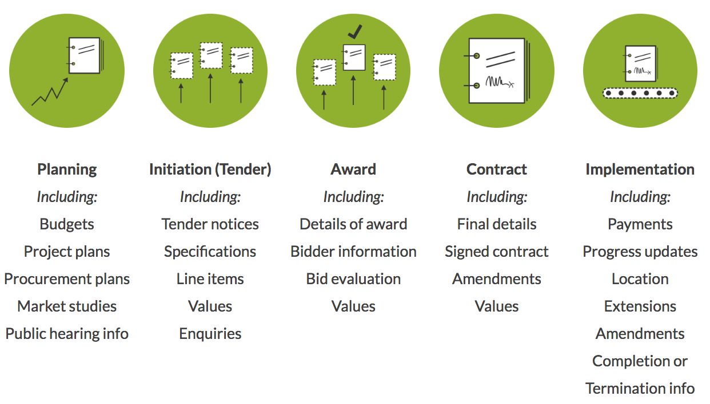

<style>
body {
  text-align: justify
}

.caption {
  text-align: center
}

caption {
  text-align: center
}


</style>

\newpage
# Introduction

The goal of this manual is to provide the basic foundations needed to analyze and visualize Open Contracting data using the R programming language to people that might be interested in pursuing this challenging but worthy endeavor. A basic understanding of computer programming will come in handy when reading this document; however, enough guidance is provided to ensure that less-tech-savy readers can also follow along.

As a part of this guide, we acquire, clean, analyze and plot Open Contracting data from 4 members of the partnership: Paraguay, Mexico, Uruguay and Colombia. This document was written using [R Notebooks](https://rmarkdown.rstudio.com/r_notebooks), a nifty feature which allows convenient integration of Markdown and R code, and exporting to HTML and PDF. The source code of this project is available [here](https://github.com).   


The rest of this document is organized as follows:

  * The remainder of this section introduces the Open Contracting Data Standard, briefly describing its main building blocks, and the R programming language, covering its core features and how to install it.
  
  * Section 2 deals with data acquisition and cleaning, focusing on reading and processing JSON files with R.
  
  * Section 3 presents the [Tidiverse](https://www.tidyverse.org), a collection of R packages designed to perform common data science tasks. Additionally, we use several of these packages to compute basic indicators of our Open Contracting data.
  
  * Finally, section 4 introduces [ggplot2](https://ggplot2.tidyverse.org) and the grammar of graphics it is based on, to draw several plots that describe our previously acquired datasets.

## An introduction to the Open Contracting Data Standard

By requiring data-sharing in a structured, re-usable and machine readable form, Open data opens up new opportunities for analysis and citizen engagement and participation. The [Open Contracting Data Standard](https://www.open-contracting.org/data-standard/) was created to apply these principles to data related to the complete contracting lifecycle including planning, tender, award, contract and implementation. 

The data standard, designed and developed through an open process, allows governments and cities around the world to share their contracting data, enabling greater transparency in public contracting, and supporting accessible and in-depth analysis of the efficiency, effectiveness, fairness, and integrity of public contracting systems. Additionally, the help desk team, staffed by Open Data Services Co-operative, is available to assist prospective users in their journey towards adoption of the standard.

The intention of this section is to introduce the reader to the standard, the use cases it was designed for and the basic concepts needed to apply it. Most of the content was taken from the official documentation of the standard; for a more thorough introductory walktrough, please refer to the [getting started guide](http://standard.open-contracting.org/latest/en/getting_started/).

### Users and use cases

The standard was designed with four main groups of user needs:

* Achieving value for money for government
* Strengthening the transparency, accountability and integrity of public contracting
* Enabling the private sector to fairly compete for public contracts
* Monitoring the effectiveness of service delivery

To find out about who is using OCDS-compliant data around the globe and how they are doing it, have a look at the [Open Contracting Partnership website](http://www.open-contracting.org/). Four potential use cases for open contracting data are:

* Value for money in procurement: helping officials get good value for money during the procurement process, and analyzing whether this goals was achieved afterwards. 
* Detecting fraud and corruption: identifying red flags that might indicate corruption by studying individual procurements or networks based on funding, ownership and interests.
* Competing for public contracts: allowing private firms to understand the potential pipeline of procurement opportunities by looking at information related to past and current procurements.
* Monitoring Service Delivery: helping interested actors to leverage traceability in the procurement process for monitoring purposes, linking budgets and donor data to the contracts and results. 

### The contracting process

The standard defines a contracting process as:

> All the planning, tendering information, awards, contracts and contract implementation information related to a single initiation process.


The standard covers all the stages of a contracting process, even though some processes might not involve all possible steps. The stages of the procurement process, with example objects that might be associated to each one, are depicted in the figure below.


```{r, echo=FALSE, fig.cap="Stages of the procurement process."}

```

For identification purposes, all contracting processes are assigned a unique Open Contracting ID (ocid), which can be used to join data from different stages. In order to avoid ocid clushers between publishers, a publisher can prepend a prefix to locally generated identifiers. Publishers are encouraged to register their prefix [here](http://standard.open-contracting.org/latest/en/implementation/registration/).


### Documents

Contracting processes are represented as **documents** in the Open Contracting Data Standard (OCDS from now on, for brevity). Each document is made up of several **sections**, mentioned below:

* release metadata: contextual information about each release of data;
    * parties: information about the organizations and other participants involved in the contracting process;
    * planning: information about the goals, budgets and projects a contracting process relates to;
    * tender: information about how a tender will take place, or has taken place;
    * awards: information on awards made as part of a contracting process;
    * contract: information on contracts signed as part of a contracting process;
        * implementation: information on the progress of each contract towards completion.

An example JSON snippet compliant with this structure looks as follows:

```{json}
{
   "language": "en",
   "ocid": "contracting-process-identifier",
   "id": "release-id",
   "date": "ISO-date",
   "tag": ["tag-from-codelist"],
   "initiationType": "tender",
   "parties": {},
   "buyer": {},
   "planning": {},
   "tender": {},
   "awards": [ {} ],
   "contracts":[ {
       "implementation":{}
   }]
}
```

There are two types of documents defined in the standard:

* **Releases** are immutable and represent updates on the contracting process. For example, they can be used to notify users of new tenders, awards, contracts and other updates. As such, a single contracting process can have many releases.

* **Records** are snapshots of the current state of a contracting process. A record should be updated every time a new release associated to its contracting process is published; hence, there should only be a single record per contracting process.

### Fields

Each section may contain several **fields** specified in the standard, which are used to represent data. These objects can appear several times in different sections of the same document; for example, items can occur in tender (to indicate the items that a buyer wishes to buy), in an award object (to indicate the items that an award has been made for) and in a contract object (to indicate the items listed in the contract). Some example fields, accompanied by corresponding JSON snippets, are presented below.

#### Parties (Organizations)

```{json}
{
    "address": {
        "countryName": "United Kingdom",
        "locality": "London",
        "postalCode": "N11 1NP",
        "region": "London",
        "streetAddress": "4, North London Business Park, Oakleigh Rd S"
    },
    "contactPoint": {
        "email": "procurement-team@example.com",
        "faxNumber": "01234 345 345",
        "name": "Procurement Team",
        "telephone": "01234 345 346",
        "url": "http://example.com/contact/"
    },
    "id": "GB-LAC-E09000003",
    "identifier": {
        "id": "E09000003",
        "legalName": "London Borough of Barnet",
        "scheme": "GB-LAC",
        "uri": "http://www.barnet.gov.uk/"
    },
    "name": "London Borough of Barnet",
    "roles": [ ... ]
}
```

#### Amounts

```{json}
{
    "amount": 11000000,
    "currency": "GBP"
}
```

#### Items

```{json}
{
    "additionalClassifications": [
       {
            "description": "Cycle path construction work",
            "id": "45233162-2",
            "scheme": "CPV",
            "uri": "http://cpv.data.ac.uk/code-45233162.html"
        }
    ],
    "classification": {
        "description": "Construction work for highways",
        "id": "45233130",
        "scheme": "CPV",
        "uri": "http://cpv.data.ac.uk/code-45233130"
    },
    "description": "string",
    "id": "0001",
    "quantity": 8,
    "unit": {
        "name": "Miles",
        "value": {
            "amount": 137000,
            "currency": "GBP"
        }
    }
}
```

#### Time Periods

```{json}
{
    "endDate": "2011-08-01T23:59:00Z",
    "startDate": "2010-07-01T00:00:00Z"
}
```

#### Documents

```{json}
{
    "datePublished": "2010-05-10T10:30:00Z",
    "description": "Award of contract to build new cycle lanes to AnyCorp Ltd.",
    "documentType": "notice",
    "format": "text/html",
    "id": "0007",
    "language": "en",
    "title": "Award notice",
    "url": "http://example.com/tender-notices/ocds-213czf-000-00001-04.html"
}
```

#### Milestones

```{json}
{
    "description": "A consultation period is open for citizen input.",
    "dueDate": "2015-04-15T17:00:00Z",
    "id": "0001",
    "title": "Consultation Period"
}
```


### Extensions and codelists

In addition to regular fields, the OCDS schema defines some fields that can only be used in certain sections, e.g. *titles* and *descriptions* of tenders, awards and contracts. In some cases, publishers may require fields that are not provided by the core schema; an **extension** allows defining new fields that can be used in these cases. A list of available extensions is available [here](http://standard.open-contracting.org/latest/en/extensions); if no existing extension addresses a publisher's needs, the publisher is encouraged to collaborate on the creation of a new community extension.

Another concept worth mentioning is that of codelists. Codelists are sets of case sensitive  strings with associated labels, available in each language OCDS has been translated into. Publishers should use codelist values whenever possible to map their existing classification systems; if needed, detail fields can be used to provide more detailed classification information. There are two types of codelists:

* **Closed codelists** are fixed sets of values. If a field is associated with a closed codelist, it should only accept an option from the published list.
* **Open codelists** are sets of recommended values. If a field is associated with an open codelist, it accepts options from the list but also other values.


The Open Contracting Data Standard is maintained using [JSON Schema](http://json-schema.org). In this section we have introduced and described the main sections and common objects used in the schema, providing JSON snippets as examples of these basic building blocks. If you are interested in the full JSON schema reference, please refer to the [official documentation](http://standard.open-contracting.org/latest/en/schema/).


## An introduction to the R programming language

R is a multi-paradigm interpreted programming language and software environment focused on statistical computing, commonly used for data analysis. It is published under the [GPL v2 license](https://www.gnu.org/licenses/old-licenses/gpl-2.0.html) and maintained by the [R Foundation](https://www.r-project.org/foundation/), with binaries available for GNU/Linux, macOS and Windows. While the basic installer comes bundled with a command line interface, several graphical integrated development environments are available, of which RStudio and RStudio Server are the most noteworthy[^1].

In this section we will introduce some of R's basic features and syntax; after going through it, the reader should be better prepared to understand the code used for analysis in the rest of the guide. Having said that, several features are ommited as a complete reference of R is out of the scope of this document. Should the reader feel inclined to learn more about R, out of curiosity or need, a list of manuals maintained by the R Development Core Team is available [here](https://cran.r-project.org/manuals.html).

For completeness and reproducibility purposes, we include a excerpt of system information below.

```{r}
R.version
```
  

[^1]: The author recommends RStudio as the go-to way to run R code and believes it is one major reason behind R's spike in popularity. Consequently, this guide was written using RStudio v1.1.453 in macOS High Sierra.

### Operators

R's arithmetic and logical operators should be familiar to most programmers, as they are common to other programming languages. It is worth mentioning that arithmetic operators work on scalars and collections.

| Operator | Description |
|:--------:|:-----------|
| **+**    | Addition    |
| **-**    | Subtraction |
| **\* **  | Multiplication|
| **/**    | Division    |
| **\*\* ** or **^**|Exponentiation&nbsp;&nbsp;&nbsp;&nbsp;&nbsp;&nbsp;&nbsp;&nbsp;&nbsp;&nbsp;&nbsp;&nbsp;&nbsp;&nbsp;&nbsp;&nbsp;|
| **%%**   | Modulus     |
Table: Some R arithmetic operators


| Operator | Description |
|:--------:|:-----------|
| **>**    | Greater than    |
| **>=**   | Greater than or equal to|
| **<**    | Lesser than|
| **<=**   | Lesser than or equal to|
| **==**   | Equal to |
| **!=**   | Not equal to |
Table: Some R logical operators

### Variables

R supports several data types including scalars, vectors (of numbers, strings, booleans, etc), matrices, dataframes and tibbles, among others. The **<-** operator is used to assign a value to a variable. A few examples of variables from these types are shown below:

```{r}
a_scalar <- 4

a_number_vector <- c(1, 2, 3, 4, 5) # all elements of a vector must be of the same type
a_string_vector <- c("a1", "b2", "c3", "d4")
a_boolean_vector <- c(TRUE, FALSE)

# lists can have elements of different types, associated to a key
a_list = list(name="John", last_name="Deer", age=42, married=FALSE)

# there are several ways to access an element from a collectionß
a_number_vector[0]
a_string_vector[[1]]
a_list$name

# a matrix is a special kind of vector, with the number of rows and columns as attributes
m <- matrix(c(1,2,3,4), nrow=2, ncol=2)
m
```

### Data Frames and Tibbles

Data types to store data tables are core to R's purpose and functionality, hence they deserve their own subsection. The most common data table type in R are data frames, which can be though of as list of vectors of equal length.

```{r}
name <- c("Mike", "Lucy", "John") 
age <- c(20, 25, 30) 
student <- c(TRUE, FALSE, TRUE) 
df = data.frame(name, age, student)  
df
```

The access operators presented for other data types can also be used to get data cells from a data frame.

```{r}
df[1,] # R has 1-based indexing, i.e. collections start at 1.
df[1,]$name # Values from a row can be accessed by column name
df$name # Columns can also be accessed directly from the data frame.
```

Another type of data table available are Tibbles. Tibbles belong to the Tidyverse, a set of libraries to perform data analysis in R following best practices that will be discussed at length in another section. For now, just think of Tibbles as data frames with some quirkyness fixed. As an example, printing a data frame displays all of its rows, which may be problematic for large datasets; printing a tibble displays only the first 10 rows by default. 

Data frames can be converted to tibbles and viceversa; the latter can be useful when dealing with older libraries that are not Tidyverse-ready. The author advises the use of tibbles and favors (as many users in the community) leveraging Tidiverse features and adhering to its guidelines as closely as possible.
```{r message=FALSE, warning=FALSE}
library(tidyverse) # Side note: this is how you import a library in R
```

```{r}
tb <- as_tibble(df)
class(as.data.frame(tb))
```

### Functions

The syntax for function definition in R is pretty straightforward and resemblant of that of other programming languages. A function receives zero, one or multiple arguments and it runs the code included in its body:

> function ( arglist ) {body}


Because the fact that R targets a specific niche (statistical computing), it offers a very rich set of built-in functions and libraries readily avaible for installation. Thus, function calls tend to be much more common in R than function definition.

Most of the R ecosystem is focused on dealing (cleaning, plotting, modelling) tabular data. As a simple display of basic statistical features, we can use the *summary* function to get descriptive statistics from a table.

```{r}
summary(tb)
```

Reading data that is already tabular is also very simple, as shown in the example below which reads a CSV file as a data frame. The file corresponds to the iris dataset, a very popular toy dataset for data science available [online](https://archive.ics.uci.edu/ml/datasets/iris).

```{r}
iris <- as_tibble(read.table("iris.csv", header=TRUE, sep=","))
iris
```

One last useful operator that is worth mentioning is the pipe *%>%*. Pipes allow function chaining in R, which favors readability and (one might say) elegance when a sequence of function calls is needed.

```{r}

# For now, there is no need to understand what each function of this snippet actually does
iris %>%
  group_by(Name) %>%
  summarize_if(is.numeric, mean) %>%
  ungroup()
```

The pipe operator passes the value of its left-hand-side operand as the first argument of its right-hand-side operand. Using it avoids the need of declaring variables to store intermediate results in additional variables (thus cluttering the namespace) or nesting function calls (all those parenthesis can be hard to read).

### Style

As a final remark, allthough there is no official code style guideline for the R programming language, the author (not surprisingly if you have been paying attention) recommends following the [Tidyverse style guide](http://style.tidyverse.org/index.html)[^2]. The [styler](http://styler.r-lib.org) package is a handy linter and code formatter that can help keeping source code compliant; it includes an RStudio add-in, the easiest way to re-style existing code.

[^2]: This notebook was written with the Tidyverse code style guide in mind. Please blame any non-conformant snippet on the lack of good coffee at that point of the writing process :)

 
## Installing R and other dependencies

Assuming a machine using Ubuntu 18.04 Bionic Beaver as its operating system, a user with *sudo* access can install the R programming language and R Studio by following these steps:

1. Update system packages to make sure already installed dependencies are up to date.
```{bash, eval=FALSE}
sudo apt update
```
2. Install the R programming language.
```{bash, eval=FALSE}
sudo apt -y install r-base
```
3. RStudio for Ubuntu comes bundled as a *.deb* package. The easiest way to install a *.deb* package in Ubuntu is by using the *gdebi* command, which is not installed in the system by default. It can be installed by running the following command.
```{bash, eval=FALSE}
sudo apt install gdebi-core
```
4. Go to the official [RStudio download page](https://www.rstudio.com/products/rstudio/download/#download) and download the file corresponding to you operating system. In our current scenario, that would be *RStudio 1.1.456 - Ubuntu 16.04+/Debian 9+ (64-bit)*.
5. From the directory in which you downloaded the package at the last step, install Rstudio using *gdebi*.
```{bash, eval=FALSE}
sudo gdebi rstudio-xenial-1.1.456-amd64.deb
```
6. Profit! You should now be able to access Rstudio by running the *rstudio* command or by clicking its icon in the apps menu.

Besides RStudio Desktop, which can be installed by following the previous set of steps, RStudio is also available in a remote access flavor. RStudio Server is an application that can be installed in a web server, thus offering the same features of the desktop version through a web browser. To find out more about this alternative and how to install it, please refer to the [official documentation](https://www.rstudio.com/products/rstudio/download-server/).

This project uses [Packrat](https://rstudio.github.io/packrat/) to keep track of all the libraries that it depends on. This ensures the portability of the software (on import, the appropriate version for the corresponding OS will be installed) and the reproducibility of the analysis. Therefore, assuming you have Git installed, playing around with this notebook should be as easy as:

1. Cloning the project
```{bash, eval=FALSE}
git clone my-awesome-repo.com
```
2. Opening it with RStudio by using the menu bar option **File -> Open Project...**


# Data acquisition

## Handling JSON files with R
## Handling big data using JSON streams


## Data loading
### From a REST API
### From JSON files
### From a Postgres database with JSONB columns


# Analysis of contracting data

## Introducing the Tidiverse
## Data cleaning functions
## Data analysis functions
## Computing basic OCDS indicators


# Data visualization


##  A data visualization primer
##  An introduction to ggplot2
##  Visualizing Open Contracting data


